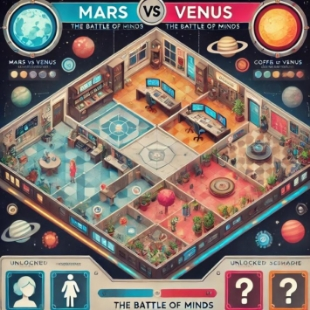

` `**Mars vs Venus: The Battle of Minds**

**שם המשחק:** Mars vs Venus: The Battle of Minds  "האם תוכל להבין את הצד השני? "  

**מהות המשחק**  

המשחק מציב את השחקן בעולם דמיוני בו גברים (מאדים) ונשים (מנוגה) הם יצורים שונים, כל צד עם מנטליות, רגשות ותפיסות עולם ייחודיות. השחקן יבחר צד – גברים או נשים – ויתמודד עם בעיות בין-מיניות, תוך כדי שהוא לומד כיצד להבין את רגשות הצד השני ולהגיב בהתאם. כל סיטואציה במשחק משקפת את האתגרים היומיומיים במערכות יחסים, וכוללת פעולות, דיאלוגים, ופתרונות יצירתיים שיכולים להוביל להצלחה או כישלון. כל סיטואציה מבוססת על בחירות ותשובות של שחקנים אחרים, והשחקן נדרש להבין את רגשות הצד השני ולפתור בעיות תקשורת כדי להצליח.  

המשחק מתמקד בניהול קשרים רגשיים תוך הדגשה של ההבדלים בתקשורת ובצורות החשיבה בין המינים. במהלך המשחק, השחקן יעבור דרך סיטואציות שונות ויתמודד עם החלטות אשר ידרשו ממנו לבחור בין גישה "מאדים" או "מנוגה". המשחק מתכנן להציע חוויה שמפתחת הבנה הדדית ותקשורת אפקטיבית בין גברים לנשים.  

**פלטפורמה**  

המשחק מיועד למחשב אישי ולטלפון נייד. המשחק יפעל בממשק ידידותי למשתמש, כאשר עבור הגרסאות הניידות תתבצע אופטימיזציה לשימוש במסך מגע. 

**רכיבים רשמיים**  

1. **שחקנים**  

` `,**גיל / רמת כישרון / רמת ניסיון** :המשחק מיועד למבוגרים בגילאי 18 ומעלה  o

במיוחד כאלו שמתעניינים בקשרי אנוש, תקשורת בין-אישית, ופסיכולוגיה חברתית. המשחק מתאים לכל רמות הניסיון, בין אם השחקן חדש בז'אנר המשחקים או מנוסה.  

` `**מספר שחקנים** :משחק שחקן יחיד עם אפשרות להשוות את התשובות שנבחרו עם  o

שחקנים אחרים וללמוד מהם. המשחק יכלול גם מערכת דירוגים שבה השחקן יכול לראות כיצד השיבו שחקנים אחרים לאותן סיטואציות.  

` `**אינטראקציה** :המשחק יעסוק בעיקר באינטראקציה שיתופית עם דגש על פתרון  o

בעיות תקשורת בין-מיניות, אך גם יהיה מקום לתחרות – השחקן יתמודד עם אתגרים שדורשים הבנת הצד השני בצורה נכונה על מנת להצליח.  

2. **יעדים**  

` `**היעדים** :השחקן צריך להבין את רגשות הצד השני בסיטואציות שונות ולבחור את  o

התשובות הנכונות מתוך מבחר אפשרויות. על השחקן לנצח את המשחק על ידי פתרון מספר סיטואציות בצורה נכונה (למשל, הבנת רגשות ותגובת הצד השני).  

` `**הודעה על היעדים** :כל שלב יכיל מטרה ברורה (לדוגמה: הבנת רגשות הצד השני  o

במצב מסוים), ותהיה גם נבנית מערכת הצבעות של שחקנים אחרים, כך שהשחקן יוכל ללמוד מהם. היעדים יוצגו מראש בסיטואציה: השחקן יצטרך להתמודד עם בעיה רגשית (לדוגמה: "מה עשוי להרגיז את הצד השני במצב כזה?") ולהבין את הדרך בה הצד השני יגיב.  

`  `o

3. **תהליכים** מי עושה מה, איפה, מתי, ואיך?**  

**תהליך ההתחלה של המשחק – שלושים השניות הראשונות**  

**מי עושה מה?**  

השחקן מתחיל את המשחק על ידי בחירת צד – גברים (מאדים) או נשים (מנוגה). בהתחלה, הוא מתוודע למערך הבסיסי של המשחק: כל צד ייחודי במנטליות שלו, עם שפע של דינמיקות רגשיות ואישיות שצריך ללמוד ולהבין. תהיה סיטואציה ראשונית בה עליהם לפתור קונפליקט עם הסבר איך לפתור אותו. תהליך זה יכלול הסבר קצר על דינמיקות תקשורת ורגשות בין-מיניים.  

**איפה?**  

התחלת המשחק מתבצעת במסך הראשי שבו השחקן בוחר את צדדים (מאדים או מנוגה). מיד לאחר הבחירה, השחקן ייחשף לסיטואציה ראשונית שתציג את האתגרים המנטליים והרגשיים של הצד שבחר.  

**מתי?**  

המשחק מתחיל מייד לאחר הבחירה. השחקן מקבל סיטואציה ראשונית שדורשת ממנו לבחור את התשובה או הפעולה המתאימה כדי להבין את הצד השני.  

**איך?**  

השחקן יתחיל את המשחק עם סצנה אינטראקטיבית קצרה הממחישה את הדינמיקה של המשחק: השחקן ייבחר פעולה מתוך אפשרויות שמוצגות לו. תהליך הבחירה יהיה פשוט – קליק על האפשרות הרצויה עם העכבר (או מגע במסך אם מדובר במובייל). לאחר הבחירה, יינתן משוב מיידי שיסביר אם הבחירה הייתה נכונה או לא. המטרה בשלב זה היא להציג לשחקן בצורה מיידית את עקרונות המשחק ולהעורר עניין עם סיטואציה מעניינת. 

**איך לגרום לשחקן להישאר?**  

כדי למשוך את השחקן להמשיך, נדאג שהסיטואציה הראשונה תהיה קלילה ומעוררת סקרנות. נגביל את הזמן לתגובה ובסוף כל סיטואציה נציג פידבק חכם ומעניין שיתאר את איך צדדים שונים יכולים לחשוב על אותה סיטואציה – שיגרום לשחקן לחשוב ולהתעניין באפשרויות נוספות.  

**תהליך הליבה של המשחק**  

**מי עושה מה?**  

השחקן בוחר בתשובות או פעולות מתוך מגוון אפשרויות (לפי סיטואציות רגשיות). כל בחירה מייצגת החלטה של דמות מהצד שבחר – גברים או נשים. כל החלטה משנה את הדרך שבה הסיפור מתפתח, וכוללת אתגרים רגשיים שדורשים מחשבה עמוקה על איך הצד השני ירגיש ויגיב.  

**איפה?**  

הסיטואציות שמוצגות לשחקן יהיו שונות – מצבים חברתיים, משימות רגשיות, תרחישי דיאלוגים – כל סיטואציה תוביל לאתגרים חדשים שמעמיקים את הבנת הדינמיקות בין הצדדים.  

**מתי?**  

השלב המרכזי של המשחק יימשך לאורך כל חוויית המשחק. כל סיטואציה תדרוש ממך להחליט כיצד להתנהג ותגיב על פי עקרונות הצד שלך (מאדים או מנוגה), וכל החלטה תשפיע על ההתקדמות שלך במשחק.  

**איך?**  

השחקן יבצע פעולות על ידי בחירה מתוך אוסף של תשובות או פעולות שניתן להציע בכל סיטואציה. השחקן יוכל להשתמש בעכבר או במסך המגע לבחור את התשובה, ויתקבל פידבק מידי שיגיד לו אם הוא היה נכון או לא.  

**איך השחקן ילמד על התהליכים?**  

השחקן ילמד דרך הניסיון והפידבק שמגיע לאחר כל סיטואציה. הפידבק יכלול הסברים על איך כל בחירה מתאימה או לא מתאימה למנטליות של הצד השני. עם כל שלב, השחקן ילמד להכיר את הקשיים וההזדמנויות בניהול קשרים בין-מיניים.  

**תהליך הסיום של המשחק**  

**מי עושה מה?**  

השחקן יגמור את המשחק כאשר יצליח להבין את הרגשות והתגובות של הצד השני בסיטואציות מרובות ויבחר את הפעולות הנכונות, או שהוא יפסיד אם טעה מספר פעמים מעל הכמות המותרת.  

**איפה?**  

המשחק יסתיים בכל סיטואציה כאשר השחקן יצליח לפתור את הבעיה הרגשית, או אם הוא יכשל ויחזור לתחילת המשחק עם מידע חדש.  

**מתי?**  

הסיום יקרה כאשר השחקן ישלים את כמות הסיטואציות הנדרשת בהצלחה, או כאשר יטעה יותר מדי פעמים. תהליך הסיום עשוי להימשך במידה ויידרש מהשחקן להבין את הרגשות של הצד השני במצבים שונים.  

**איך?**  

אם השחקן מצליח בפתרון, הוא יגיע לשלב הסיום, ויוצג לו סיכום על איך ניהל את הדינמיקות בהצלחה – הצלחה במציאת פתרונות נכונים למערכת יחסים. אם השחקן טועה מספר פעמים יותר מדי, יינתן פידבק שמסביר את טעויותיו, והשחקן יוכל לחזור ולנסות שוב.  

**איך השחקן ילמד על התהליכים?**  

השחקן ילמד מתוך כל סיטואציה איך להימנע מטעויות וילמד את דפוסי התנהגות הצד השני. כל טעויותיו יוסברו בצורה שתעזור לו להבין טוב יותר את ההתנהגות של הצד השני ולקדם את המשחק בצורה חכמה יותר.  

4. **חוקים**  
- **החוקים** :השחקן יבחר פעולות ודיאלוגים מתוך רשימה, בהתאם לאופי הצד השני. כל תשובה לא נכונה תוביל להפסד נקודות או החזרת התשובות.  
- **למידה** :השחקן ילמד את החוקים דרך מקרים מובהקים בתוך המשחק, אשר יעזרו לו להבין את המנטליות של הצד השני - כל שלב ילווה בהסבר קטן על דינמיקות תקשורת שונות בין המינים.  

**חוקים שיגבילו את פעולות השחקן במשחק**  

1. **הגבלות על בחירות רגשות ותגובות**  

   כל בחירה שתעשה השחקן בסיטואציה, בין אם זה דיאלוג או פעולה, תתבסס על המנטליות של הצד שבחר (מאדים או מנוגה). השחקן לא יוכל לבחור בחירה שמתאימה לצד השני מבלי לקבל תוצאה שלילית (למשל: גברים שמנסים להבין את הצד הנשי או להיפך). החוקים המגבילים את פעולות השחקן יציבו את האתגרים בהבנת הדרך בה הצד השני רואה את המצב.  

2. **כמות טעויות מוגבלת**  

   השחקן יכול לטעות מספר פעמים לפני שהוא נכשל. מספר הטעויות המותרות עשוי להיות מוגבל, לדוגמה – 3 טעויות בלבד. כל טעות תסביר לשחקן מה היה יכול לעשות אחרת ומה היה הגישה הנכונה לסיטואציה.  

3. **הגבלות על הזמן**  

   לסיטואציות מסוימות תהיה מגבלת זמן. השחקן יצטרך להגיב במהרה ולעיתים ייאלץ להחליט במהירות איך לפעול בסיטואציה רגשית או חברתית, על מנת להפעיל את חוויית המשחק במתח גבוה ולהגביר את האתגר.  

**לפי איזה חוקים ייקבעו תוצאות של פעולות במשחק?**  

1. **תוצאה נכונה או לא נכונה**  

   הבחירה של השחקן תוערך לפי כיצד היא מתאימה לפסיכולוגיה ולמנטליות של הצד השני. לדוגמה, גבר שמנסה להבין אשה בתגובה רגשית מסוימת, אם הבחירה לא נכונה לפי מערכת ערכים נשית (מצד מנוגה), יינתן פידבק על כך שהבחירה לא עזרה לפתור את הבעיה. כל תוצאה תינתן יחד עם הסבר מדוע זה נכון או לא.  

2. **השפעה על הדינמיקה הבין-אישית**  

   השחקן יקבל משוב לגבי כל בחירה, ולדוגמה – אם הוא בוחר פתרון שגברים יבחרו עליו (לדוגמה, פתרון עוקף או ישיר), הוא יקבל תוצאה שיכולה להוביל לנכונות לצד השני, אבל לא בהכרח תצליח לפתור את המצב באופן מלא.  

3. **התקדמות במשחק**  

   כל הצלחה בהבנת רגשות הצד השני תוביל את השחקן להמשך עלילה. כל בחירה נכונה תביא להתרחשויות חיוביות ולקידום במערכות היחסים בין הצדדים. אם השחקן יכשל יותר מדי פעמים, יינתן משוב שיבהיר לו את סיבת הכישלון ויציע לו פתרון חדש להתמודדות עם סיטואציה דומה.  

**איך השחקן ילמד את חוקי המשחק?**  

1. **הוראות אינטראקטיביות**  

   המשחק יתחיל עם סצנה הדרכתית שבה השחקן ילמד את החוקים הבסיסיים של המשחק – איך לבחור פעולה, איך להבין את הצעדים של הצד השני, ואיך להתמודד עם דינמיקות בין- מיניות. הוראות אלו יהיו משולבות בסיפור האינטרקטיבי ותוצגנה תוך כדי משחק.  

2. **הדרכה באמצעות פידבק**  

   כל פעולה של השחקן תהיה מלווה בפידבק מיידי – אם הוא בחר תשובה נכונה או לא, מה הייתה התוצאה של הבחירה ואיך התשובה משפיעה על הדינמיקה של המשחק. כל טעות תלווה בהסבר על מה השחקן יכול היה לעשות אחרת, כך שהשחקן יוכל ללמוד ולהשתפר.  

3. **סיטואציות חינוכיות**  

   במהלך המשחק, יהיו סיטואציות שבהן השחקן יתנסה בכמה דיאלוגים שדורשים הבנה בין- מינית. עם כל כישלון או הצלחה, יינתן הסבר שיסייע להבין את החוקים העומדים מאחורי כל סיטואציה. כלומר, השחקן ילמד את התהליכים דרך ההתנסות והפידבק. בנוסף נוסיף קטעי מידע על פסיכולוגיה אנושית ותעזור לנח סיטואציות מורכבות.  

5\.  **משאבים**  

1. **משאבים עיקריים:**  

` `**נקודות תקשורת / אמפתיה** :כוח חיוני במשחק, המשאבים העיקריים הם נקודות  o

שמייצגות את ההבנה והאמפתיה של השחקן כלפי הצד השני. נקודות אלו מוענקות לשחקן בכל פעם שהוא בוחר פתרון נכון שמבטא הבנה מדויקת של רגשות הצד השני.  

` `**כוחות יצירתיים** :משאב נוסף שיהיה זמין לשחקן הוא היכולת לפתור בעיות בצורה  o

יצירתית, לדוגמה על ידי שילוב של רעיונות של שני הצדדים (מאדים ומנוגה). כל פתרון יצירתי יביא למשאבים נוספים שיכולים לשדרג את הקשר בין הדמויות במשחק.  

2. **איך המשאבים הללו יועילו לשחקן?**  

` `,**נקודות אמפתיה** :ישמשו להשגת פתרונות יותר יעילים לקונפליקטים בין הדמויות  o

והן עשויות לפתוח סצנות או דיאלוגים נוספים. כל מהלך נכון שיביא להבנה הדדית בין הצדדים יאפשר לשחקן להרוויח יותר נקודות אמפתיה, ולהתקדם בסיפור.  

` `**כוחות יצירתיים** :יסייעו לשחקן להימנע מהכישלון בסיטואציות מאתגרות, כאשר  o

יוכל להפעיל פתרונות שהשחקן בעצמו לא היה חושב עליהם, כמו היכולת לשלב רעיונות יצירתיים מבלי להיתקל בקירות רגשיים.  

3. **איך השחקן יוכל להשיג משאבים?**  

` `,**עבודה עם דמויות** :השחקן יוכל להשיג נקודות אמפתיה על ידי פתרון קונפליקטים  o

או על ידי הבחירה בתשובות מדויקות ושיחה חכמה עם הדמויות השונות. דיאלוגים ושיתופי פעולה עם הדמויות הראשיות יאפשרו לשחקן לצבור יותר משאבים.  

` `**פיתרון אתגרים רגשיים** :כל פעם שהשחקן פותר דילמה בין-מינית בהצלחה (הבנת  o

הצד השני), הוא יקבל משאבים. משאבים אלה יכולים להיתפס כ"שיקול דעת רגיש", שייתן לשחקן יתרון בתהליכים מאוחרים במשחק.  

4. **איך עיצוב המשחק יגרום לכך שהמשאבים יהיו נדירים (לא קל להשיג אותם)?**  

` `**אתגרים רגשיים** :המשחק יהיה מתואם כך שהשחקן ייאלץ להתמודד עם  o

קונפליקטים רגשיים מורכבים שבהם כל בחירה לא נכונה יכולה להוביל לפסילת אפשרויות ולהפסד נקודות. המשאבים לא יינתנו בקלות, שכן כל פתרון דורש חשיבה מעמיקה על הדינמיקות שבין הצדדים.  

` `**הפיכת הבחירות למשמעותיות** :כל החלטה תהיה משמעותית, והשחקן לא יקבל  o

משאבים בקלות. כדי לפתור כל סיטואציה, השחקן יזדקק להבנה עמוקה יותר של הרגשות של הצד השני, מה שמציב אתגרים ומתמרץ את השחקן להיות יותר קשוב ומדויק. מצבים קשים יותר יבטיחו משאבים נדירים יותר.  

5. **איך המשחק יודיע לשחקן מה הם המשאבים במשחק, וכמה משאבים יש לו בכל רגע?**  

` `**ממשק אינטראקטיבי** :בסרגל כלים ברור, המשחק יציג את כמות המשאבים  o

שנצברו על ידי השחקן. השחקן יוכל לראות את מספר נקודות האמפתיה שהוא צבר, ואת מדד "הכוחות היצירתיים" שעומדים לרשותו בכל רגע נתון.  

` `**הודעות במשחק** :במהלך הסיפור, ההודעות והפידבקים מהדמויות יתארו את כמות  o

המשאבים שהשחקן השיג, מה שתומך בלמידה מתמשכת של התהליכים השונים והכוונה לשחקן כיצד להתנהל עם המשאבים הללו.  

- **מדדים וגרפים חזותיים** :הממשק יציג מדדים גרפיים ברורים שיתעדו את מספר המשאבים של השחקן (בעיקר נקודות אמפתיה ויצירתיות), כך שהשחקן יוכל לזהות את מצבם של המשאבים על פי גרפים או מדדים חזותיים בתפריטים.  
6. **עימותים**  
- **עימותים עם המערכת** :מכשולים רגשיים במצבים בין-מיניים.עימותים עם המערכת יכילו אתגרים רגשיים במצבים של חוסר הבנה. לדוגמה: מבחר תשובות שמייצגות רעיונות שונים של גברים ונשים.  
- **עימותים עם שחקנים אחרים** :כל שחקן ייתקל באתגרים שדורשים ממנו להתמודד עם הבחירות של שחקנים אחרים ולראות האם הוא בחר נכונה. זה נותן גם טוויסט לאופן העימות פה שהוא לא תחרות כמו הצבת אתגרים בפני האחד והשני.  
- **עימותים עם עצמך** :הבחירה בין פתרונות שנראה כי יש להם תוצאה לא רצויה. השחקן יצטרך להתמודד עם דילמות קשות ולבחור בין פתרונות שיכולים להיות נכונים או לא.  

בין השחקן למערכת (מכשולים): 

הבנת הדינמיות בין-מיניות: השחקן ייתקל בקשיים בהבנת דרך החשיבה של הצד השני (מאדים או מנוגה), כאשר כל בחירה לא נכונה יכולה להוביל לתוצאה שלילית, כגון אובדן נקודות אמפתיה או כישלון במשימות. המכשול המרכזי יהיה להבין את רגשות הצד השני ולהגיב בצורה המתאימה. 

טעויות בתגובה רגשית: כל פעם שהשחקן יבחר תגובה לא מתאימה, ייתכן ותתרחש "חסימה" או עיכוב בהתקדמות המשחק. השחקן יצטרך להתגבר על המכשול הזה על ידי לימוד הדינמיקה הרגשית של הצד השני ושימוש בנקודות אמפתיה או כוחות יצירתיים כדי להמשיך במשחק. 

אתגרים זמניים: סיטואציות בהן השחקן יצטרך לקבל החלטות תוך מגבלת זמן. מדובר במכשול שמשפיע על קצב המשחק ודורש מהשחקן להתמקד ולהגיב מהר בהתאם לרגשות הצד השני. 

בין השחקן לשחקנים אחרים (יריבים): 

כל שחקן ייתקל באתגרים שדורשים ממנו להתמודד עם הבחירות של שחקנים אחרים ולראות האם הוא בחר נכונה. זה נותן גם טוויסט לאופן העימות פה שהוא לא תחרות כמו הצבת אתגרים בפני האחד והשני. 

תיאום בין-מיני: בחלקים מסוימים במשחק, השחקן יצטרך לשתף פעולה עם דמויות מהצד השני כדי לפתור בעיות משותפות. במקרים אלו, השחקן יתמודד עם יריבויות דינמיות, שיכולות להיווצר כאשר הדמויות לא מצליחות להבין אחת את השנייה או כאשר הצורך לשתף פעולה יוביל לקונפליקט. 

בין השחקן לעצמו (דילמות) 

הבחירה בין פתרונות שנראה כי יש להם תוצאה לא רצויה. השחקן יצטרך להתמודד עם דילמות קשות ולבחור בין פתרונות שיכולים להיות נכונים או לא. 

הבנת רגשותיו האישיים: השחקן ייתקל בדילמות פנימיות בנוגע לאופן שבו הוא רואה את הצד השני. לדוגמה, כאשר השחקן מגלם את צד מאדים, הוא עשוי לחוות קונפליקט פנימי אם להמשיך לחשוב באופן גברי או לנסות להבין את הצד הנשי בצורה יותר רגשית. כל דילמה כזו משפיעה על התקדמותו במשחק. 

מוסר ואמפתיה: בחלקים מהמשחק, השחקן יצטרך להתמודד עם דילמות מוסריות ואמפתיות – לדוגמה, האם להפעיל פתרון ישיר שיסייע לו להוציא את עצמו ממצב קשה או האם לנסות את הדרך ההפוכה, שבה יידרש יותר רגש כדי להצליח. החלטות מסוג זה ישפיעו על הדינמיקה בין הדמויות ויקבעו את הכיוון שבו ילך הסיפור. 

7. **גבולות**  
- העולם יהיה **סגור** ושטוח, וכל סיטואציה תתקיים במקום מסוים (כמו שולחן עבודה, בית קפה, מסיבת סיום וכו').  
- השחקן יצטרך להבין את גבולות המשחק ולהתמודד עם סיטואציות בתוך הגבולות המוגדרים של העולם - גבולות המשחק יוצגו עם מסגרת שמוגדרת לכל מצב.  

**עקרונות תכנון המפה:**  

1\.  **משמעו**ת- אין מקום במפה שאין לו מטרה, **ניידו**ת – הניידות תהיה ע"י לחיצת עכבר או מסך מגע על כפתורים בממשק משתמש שיאפשרו להגיע למקומות שונים במשחק. חלק מהניידות 

כמו הגעה לשלבים הבאים תהיה אפשרית רק 

אחרי פתרון שלבים קודמים. **התמצאות –** 

ההתמצאות תגיע מההסבר במהלך המשחק 

ויהיה גם אייקון של ? שניתן יהיו לראות בו את 

ההוראות שנית. **עניין** – זה מעניין את השחקן 

כי זו דרך ההתמצאות שלו, **הכוונה** – יהיה מסך 

ראשי ממנו ניתן להגיע לשאר המקומות ויהיה 

ברור לפי חיצים ושמות וסימנים שיסבירו את 

המיקום.  

.2

8\.  **תוצאות**  

` `**תוצאה אחת** :השחקן יכול לנצח אם מצליח לפתור מספיק סיטואציות. כל החלטה  o

שגויה תוביל לתוצאה אחרת.  

` `התוצאה **תלויה בכישרון** :הבנת רגשות הצד השני חשובה לניצחון, אך בהחלט יכול  o

להיות גם אלמנט של מזל (כיצד תבחר תשובה נכונה בסיטואציה מסוימת).  

**סקר שוק**  

- חיפשתי את המונחים הבאים:  

`  `"gender communication games"  o   "relationship strategy games"  o

`  `"social dynamics games"  o

` `משחקים כמו  ,*The Sims*, *Life is Strange*ו *Choices: Stories You Play*- מתמודדים עם ניהול 

מערכות יחסים, אך אינם מציעים את הדינמיקה המיוחדת של "גברים ממאדים ונשים מנוגה."  מה שמייחד את המשחק שלנו הוא ההבנה העמוקה של המנטליות המינית-חברתית דרך משימות משולבות עם קהל שחקנים אחר.  

**: "Relationship Goals"1 משחק**

- **קישור**: 

[https://play.google.com/store/apps/details?id=com.tender.relationshipgoals&](https://play.google.com/store/apps/details?id=com.tender.relationshipgoals&hl=en)

` `[ hl=en](https://play.google.com/store/apps/details?id=com.tender.relationshipgoals&hl=en)

- **תיאור** :המשחק עוסק בניהול מערכות יחסים רומנטיות, כולל דיאלוגים, החלטות, ואתגרים רגשיים.  
- **מה דומה** :המשחק עוסק בניהול מערכת יחסים, עם בחירות שמובילות לתוצאות שונות – בדיוק כמו במשחק שלנו.  
- **מה נעשה אחרת** :בעוד ש "Relationship Goals"-מתמקד בעיקר בהיבטים הרומנטיים של הקשר "Mars vs Venus" ,יחקור את הדינמיקה המגדרית בין גברים לנשים, ויתמקד בהבנה עמוקה של רגשות ותחושות מתוך הפרספקטיבה של כל צד (מאדים מול מנוגה). המשחק שלנו יכיל גם חינוך חברתי שיאפשר לשחקנים ללמוד על הבדל המנטליות של כל צד.  
  - **רכיב ייחודי** :אינטראקציות רגשיות מעמיקות שיתאימו לכל צד ויאפשרו לשחקן להתנסות ולהבין את דינמיקות הצד השני.  

**משחק The Sims" 2" (סדרת משחקים)**  

` `[ https://www.ea.com/games/the-sims : ](https://www.ea.com/games/the-sims)**קי[שור**](https://www.ea.com/games/the-sims)** ￿

- **תיאור** :סדרת "The Sims" היא משחק סימולציה המאפשר לשחקנים ליצור ולנהל דמויות, כולל אינטראקציות חברתיות ומערכות יחסים.  
- **מה דומה** :המשחקים מציעים יכולת ניהול מערכות יחסים ודינמיקה חברתית.  

, "Mars הוא משחק פתוח שמאפשר חופש מוחלט-"The Sims" **מה נעשה אחרת** :בעוד ש ￿  יתמקד במבנה סגור שמאתגר את השחקן להביא לפתרונות ייחודיים לדינמיקותvs Venus" 

בין-מיניות. כל משימה במשחק שלנו תדרוש הבנה מעמיקה של הצד השני, בשונה 

`  `"The Sims".מהסימולציה החופשית של

- **רכיב ייחודי** :הפוקוס על תקשורת בין-מינית והשפעתה על פתרון בעיות רגשיות.  

**משחק Haven" :3"**  

- [**קישור:** https://store.steampowered.com/app/983970/Haven/ ](https://store.steampowered.com/app/983970/Haven/) 
- **תיאור:** "Haven" הוא משחק הרפתקאות אקשן שבו השחקנים שולים את דרכם על כוכב לכת פראי, תוך כדי שהם מגלים את סיפור האהבה של שני דמויות עיקריות, Yu ו-Kai. המטרה במשחק היא לנהל את מערכות היחסים שלהם, לגלות את הסודות של עולם המשחק ולשרוד בתנאים קשים.  
- **מה דומה:** כמו ב-"Mars vs Venus", "Haven" מתמקד בקשר בין שני דמויות, ובמיוחד בקשר הרגשי ביניהם. הוא גם מציב אתגרים בתקשורת והבנה בין שני צדדים, אם כי כאן מדובר יותר בזוגיות במקום במערכת יחסים בין-מינית רחבה יותר.  
- **מה נעשה אחרת**: ב-"Haven", הדגש נמצא על הרפתקאות חקירה, עיצוב עולם פתוח, והמיקוד בזוגיות רומנטית. "Mars vs Venus", מצד שני, יעסוק בהבנת הדינמיקות בין- מיניות על פי הבדל במנטליות בין גברים לנשים, תוך מתן אפשרות לשחקן להבין ולבחור את הדרך בה הוא פותר בעיות בין-מיניות.  
- **רכיב ייחודי**: "Mars vs Venus" יתמקד בסיטואציות שבהן השחקן מתמודד עם קונפליקטים על בסיס הבחירה בין פתרונות שמבוססים על המנטליות של גברים או נשים, מה שמעמיק את ההבנה של השחקן לגבי דינמיקות מגדריות**.**  

**כיצד המשחק שלנו יהיה שונה?**  

המשחק שלנו יתמקד בהבנת הצרכים והרגשות של כל צד, גברים ונשים, תוך כדי פיתוח מודעות חברתית ורגשית. בניגוד למשחקים אחרים שמתמקדים בקונפליקטים חברתיים כללים Mars vs" ,

"Venusיציע חוויית משחק שמציבה את השחקן במרכז של אתגרים רגשיים-מגדריים תוך דגש על 

פתרונות יצירתיים ובחירות שמובילות להצלחה או כישלון, מתוך הבנת הדינמיקות המגדריות.  

**רכיב ייחודי: אינטראקציה רגשית ותקשורת**  

המשחק שלנו יציע חוויית משחק שונה בכך שמבוססת על הבנת המנטליות של שני הצדדים. השחקן יצטרך להתמודד עם משימות שדורשות להבין ולהגיב על פי התחושות של הדמויות מהצד השני – גברים או נשים.  
