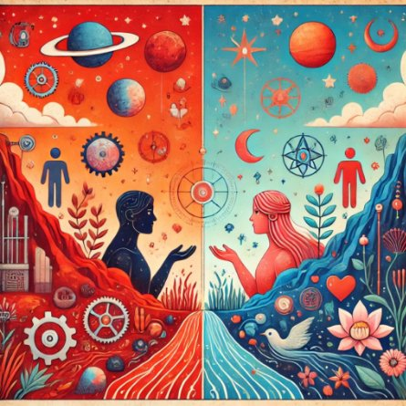
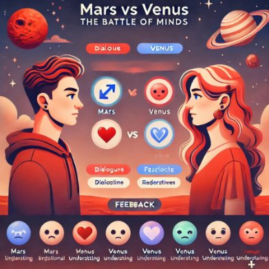
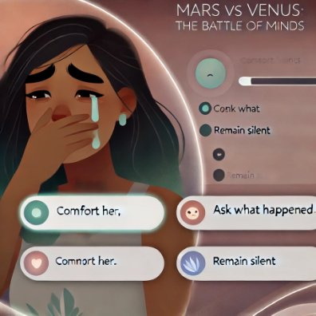
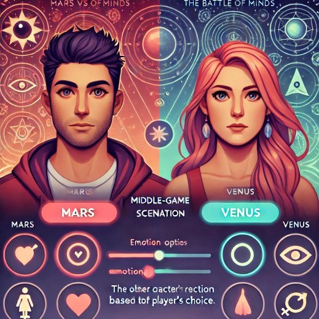
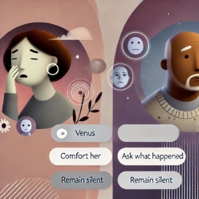
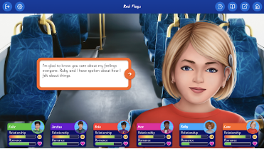
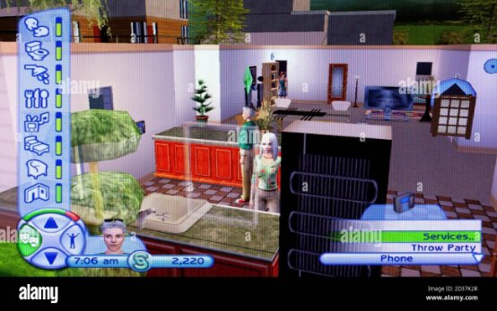
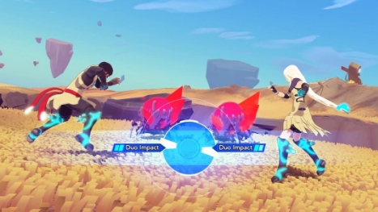

# Mars vs Venus: The Battle of Minds

**שם המשחק:** Mars vs Venus: The Battle of Minds  
*האם תוכל להבין את הצד השני?*

## מהות המשחק

המשחק מציב את השחקן בעולם דמיוני בו גברים (מאדים) ונשים (מנוגה) הם יצורים שונים, כל צד עם מנטליות, רגשות ותפיסות עולם ייחודיות. השחקן יבחר צד – גברים או נשים – ויתמודד עם בעיות בין-מיניות, תוך כדי שהוא לומד כיצד להבין את רגשות הצד השני ולהגיב בהתאם. 

כל סיטואציה במשחק משקפת את האתגרים היומיומיים במערכות יחסים, וכוללת פעולות, דיאלוגים ופתרונות יצירתיים שיכולים להוביל להצלחה או כישלון. כל סיטואציה מבוססת על בחירות ותשובות של שחקנים אחרים, והשחקן נדרש להבין את רגשות הצד השני ולפתור בעיות תקשורת כדי להצליח.

המשחק מתמקד בניהול קשרים רגשיים תוך הדגשה של ההבדלים בתקשורת ובצורות החשיבה בין המינים. במהלך המשחק, השחקן יעבור דרך סיטואציות שונות ויתמודד עם החלטות אשר ידרשו ממנו לבחור בין גישה "מאדים" או "מנוגה". המשחק מתכנן להציע חוויה שמפתחת הבנה הדדית ותקשורת אפקטיבית בין גברים לנשים.

## פלטפורמה

המשחק מיועד למחשב אישי ולטלפון נייד. המשחק יפעל בממשק ידידותי למשתמש, כאשר עבור הגרסאות הניידות תתבצע אופטימיזציה לשימוש במסך מגע.

## רכיבים רשמיים

### 1. שחקנים

- **גיל / רמת כישרון / רמת ניסיון**: המשחק מיועד למבוגרים בגילאי 18 ומעלה, במיוחד לאנשים המתעניינים בקשרי אנוש, תקשורת בין-אישית ופסיכולוגיה חברתית. המשחק מתאים לכל רמות הניסיון, בין אם השחקן חדש בז'אנר המשחקים או מנוסה.

- **מספר שחקנים**: זהו משחק שחקן יחיד עם אפשרות להשוות את התשובות שנבחרו עם שחקנים אחרים וללמוד מהם. המשחק יכלול גם מערכת דירוגים, שבה השחקן יוכל לראות כיצד השיבו שחקנים אחרים לאותן סיטואציות.

- **אינטראקציה**: המשחק יעסוק בעיקר באינטראקציה שיתופית עם דגש על פתרון בעיות תקשורת בין-מיניות, אך גם יהיה מקום לתחרות. השחקן יתמודד עם אתגרים שדורשים הבנה של הצד השני בצורה נכונה על מנת להצליח.

### 2. יעדים

- **היעדים**: השחקן צריך להבין את רגשות הצד השני בסיטואציות שונות ולבחור את התשובות הנכונות מתוך מבחר אפשרויות. על השחקן לנצח את המשחק על ידי פתרון מספר סיטואציות בצורה נכונה (לדוגמה, הבנת רגשות ותגובת הצד השני).

- **הודעה על היעדים**: כל שלב יכיל מטרה ברורה (לדוגמה: הבנת רגשות הצד השני במצב מסוים), ותהיה מערכת הצבעות של שחקנים אחרים כך שהשחקן יוכל ללמוד מהם. היעדים יוצגו מראש בכל סיטואציה: השחקן יצטרך להתמודד עם בעיה רגשית (כגון: "מה עשוי להרגיז את הצד השני במצב כזה?") ולהבין את הדרך בה הצד השני יגיב.

### 3. תהליכים: מי עושה מה, איפה, מתי, ואיך?

#### תהליך ההתחלה של המשחק – שלושים השניות הראשונות

- **מי עושה מה?**:  
  השחקן מתחיל את המשחק על ידי בחירת צד – גברים (מאדים) או נשים (מנוגה). בהתחלה, הוא מתוודע למערך הבסיסי של המשחק: כל צד ייחודי במנטליות שלו, עם דינמיקות רגשיות ואישיות ייחודיות. תהיה סיטואציה ראשונית בה יצטרך השחקן לפתור קונפליקט, עם הסבר על דינמיקות תקשורת ורגשות בין-מיניים.

- **איפה?**:  
  התחלת המשחק מתבצעת במסך הראשי שבו השחקן בוחר צד (מאדים או מנוגה). מיד לאחר הבחירה, השחקן ייחשף לסיטואציה ראשונית שתציג את האתגרים המנטליים והרגשיים של הצד שבחר.

- **מתי?**:  
  המשחק מתחיל מייד לאחר הבחירה. השחקן מקבל סיטואציה ראשונית שדורשת ממנו לבחור את התשובה או הפעולה המתאימה כדי להבין את הצד השני.

- **איך?**:  
  השחקן מתחיל עם סצנה אינטראקטיבית קצרה המדגימה את הדינמיקה של המשחק: השחקן ייבחר פעולה מתוך אפשרויות המוצגות לו. תהליך הבחירה יהיה פשוט – קליק עם העכבר או מגע במסך במובייל. לאחר הבחירה, יינתן משוב מיידי שיסביר אם הבחירה הייתה נכונה או לא. המטרה בשלב זה היא להציג לשחקן את עקרונות המשחק ולעורר עניין.

- **איך לגרום לשחקן להישאר?**:  
  כדי למשוך את השחקן להמשיך, הסיטואציה הראשונה תהיה קלילה ומעוררת סקרנות. נגביל את זמן התגובה ובסוף כל סיטואציה נציג פידבק מעניין שיתאר איך צדדים שונים יכולים לחשוב על אותה סיטואציה – מה שיגרום לשחקן לחשוב ולהתעניין באפשרויות נוספות.

#### תהליך הליבה של המשחק

- **מי עושה מה?**:  
  השחקן בוחר בתשובות או פעולות מתוך מגוון אפשרויות לפי הסיטואציה. כל בחירה מייצגת החלטה של דמות מהצד שבחר – גברים או נשים. כל החלטה משפיעה על התפתחות הסיפור, וכוללת אתגרים רגשיים שדורשים מחשבה על רגשות הצד השני.

- **איפה?**:  
  הסיטואציות המוצגות לשחקן משתנות – מצבים חברתיים, משימות רגשיות, תרחישי דיאלוגים – כל סיטואציה מוסיפה אתגרים חדשים להבנת הדינמיקות בין הצדדים.

- **מתי?**:  
  התהליך המרכזי נמשך לאורך כל חוויית המשחק. כל סיטואציה תדרוש החלטות על פי עקרונות הצד שלך (מאדים או מנוגה), וכל החלטה תשפיע על התקדמותך במשחק.

- **איך?**:  
  השחקן יבצע פעולות על ידי בחירה מתוך תשובות או פעולות אפשריות בכל סיטואציה. יתקבל פידבק מידי שיסביר אם הבחירה הייתה נכונה או לא.

- **איך השחקן ילמד על התהליכים?**:  
  השחקן ילמד דרך הניסיון והפידבק שמתקבל לאחר כל סיטואציה. הפידבק יכלול הסברים על התאמת כל בחירה למנטליות של הצד השני, ובכך ילמד השחקן להתמודד עם קשיים והזדמנויות בניהול קשרים בין-מיניים.

#### תהליך הסיום של המשחק

- **מי עושה מה?**:  
  השחקן יסיים את המשחק כאשר יצליח להבין את רגשות ותגובות הצד השני במספר סיטואציות ויבחר את הפעולות הנכונות, או שיפסיד אם יעשה יותר מדי טעויות.

- **איפה?**:  
  המשחק יסתיים בכל סיטואציה כאשר השחקן יצליח לפתור את הבעיה הרגשית, או אם יכשל ויתחיל מחדש עם מידע נוסף.

- **מתי?**:  
  הסיום יקרה כאשר השחקן ישלים את כמות הסיטואציות הנדרשת בהצלחה, או כאשר יעשה יותר מדי טעויות. תהליך הסיום עשוי להימשך במידה והשחקן נדרש להבין את רגשות הצד השני במצבים שונים.

- **איך?**:  
  אם השחקן מצליח בפתרון, הוא יגיע לשלב הסיום, שבו יוצג סיכום להצלחתו בניהול הדינמיקות – הצלחה במציאת פתרונות למערכת יחסים. אם השחקן טועה יותר מדי פעמים, יינתן פידבק עם הסברים על טעויותיו, והשחקן יוכל לחזור ולנסות שוב.

- **איך השחקן ילמד על התהליכים?**:  
  השחקן ילמד מכל סיטואציה כיצד להימנע מטעויות ויבין את דפוסי ההתנהגות של הצד השני. כל טעות תלווה בהסבר שיעזור לו להבין טוב יותר את התנהגות הצד השני ולקדם את המשחק בצורה חכמה יותר.

### 4. חוקים

- **החוקים**: השחקן יבחר פעולות ודיאלוגים מתוך רשימה, בהתאם לאופי הצד השני. כל תשובה לא נכונה תוביל להפסד נקודות או לחזרת התשובות.
- **למידה**: השחקן ילמד את החוקים דרך מקרים מובהקים בתוך המשחק, אשר יעזרו לו להבין את המנטליות של הצד השני. כל שלב ילווה בהסבר קצר על דינמיקות תקשורת שונות בין המינים.

#### חוקים שיגבילו את פעולות השחקן במשחק

1. **הגבלות על בחירות רגשות ותגובות**:  
   כל בחירה שהשחקן עושה, בין אם זה דיאלוג או פעולה, תתבסס על המנטליות של הצד שבחר (מאדים או מנוגה). השחקן לא יוכל לבחור אפשרות שמתאימה לצד השני מבלי לקבל תוצאה שלילית (למשל: גברים שמנסים להבין את הצד הנשי או להיפך). חוקים אלה מציבים אתגר בהבנת הדרך בה הצד השני רואה את המצב.

2. **כמות טעויות מוגבלת**:  
   השחקן יכול לטעות מספר פעמים לפני שהוא נכשל. מספר הטעויות המותרות מוגבל, לדוגמה – 3 טעויות בלבד. כל טעות תסביר לשחקן מה יכול היה לעשות אחרת ומה היה הגישה הנכונה לסיטואציה.

3. **הגבלות על הזמן**:  
   בסיטואציות מסוימות תהיה מגבלת זמן, והשחקן יצטרך להגיב במהרה. לעיתים יהיה עליו להחליט במהירות איך לפעול בסיטואציה רגשית או חברתית, כדי לשמור על מתח גבוה ולהגביר את האתגר במשחק.

#### לפי איזה חוקים ייקבעו תוצאות של פעולות במשחק?

1. **תוצאה נכונה או לא נכונה**:  
   הבחירה של השחקן תוערך לפי ההתאמה לפסיכולוגיה ולמנטליות של הצד השני. לדוגמה, גבר שמנסה להבין תגובה רגשית נשית עשוי לקבל פידבק על כך שהבחירה לא עזרה לפתור את הבעיה, עם הסבר מדוע.

2. **השפעה על הדינמיקה הבין-אישית**:  
   השחקן יקבל משוב על כל בחירה. לדוגמה, בחירה בפתרון טיפוסי לגברים עשויה להוביל לתוצאה המובנת לצד השני אך לא תפתור את המצב במלואו.

3. **התקדמות במשחק**:  
   כל הצלחה בהבנת רגשות הצד השני תוביל להמשך העלילה. בחירה נכונה תקדם את מערכות היחסים בין הצדדים. במקרה של כישלונות מרובים, יינתן משוב המסביר את הסיבה ויציע פתרון נוסף.

#### איך השחקן ילמד את חוקי המשחק?

1. **הוראות אינטראקטיביות**:  
   המשחק מתחיל עם סצנה הדרכתית שבה השחקן ילמד את החוקים הבסיסיים – כיצד לבחור פעולה, להבין את צעדי הצד השני ולהתמודד עם דינמיקות בין-מיניות. ההוראות יהיו משולבות בסיפור ותוצגנה במהלך המשחק.

2. **הדרכה באמצעות פידבק**:  
   כל פעולה של השחקן תלווה בפידבק מיידי על התוצאה ואיך היא משפיעה על הדינמיקה. כל טעות תלווה בהסבר על מה היה ניתן לעשות אחרת, כך שהשחקן יוכל ללמוד ולהשתפר.

3. **סיטואציות חינוכיות**:  
   במהלך המשחק יכללו סיטואציות שבהן השחקן יתנסה בדיאלוגים הדורשים הבנה בין-מינית. כל הצלחה או כישלון ילווה בהסבר המסייע להבין את החוקים שמאחורי כל סיטואציה. נוסיף גם קטעי מידע על פסיכולוגיה אנושית כדי להתמודד עם סיטואציות מורכבות.

### 5. משאבים

#### 1. משאבים עיקריים

- **נקודות תקשורת / אמפתיה**:  
  זהו כוח חיוני במשחק; המשאבים העיקריים הם נקודות המייצגות את ההבנה והאמפתיה של השחקן כלפי הצד השני. נקודות אלו מוענקות לשחקן בכל פעם שהוא בוחר פתרון נכון שמבטא הבנה מדויקת של רגשות הצד השני.

- **כוחות יצירתיים**:  
  משאב נוסף שיהיה זמין לשחקן הוא היכולת לפתור בעיות בצורה יצירתית, לדוגמה על ידי שילוב רעיונות של שני הצדדים (מאדים ומנוגה). כל פתרון יצירתי יביא למשאבים נוספים שיכולים לשדרג את הקשר בין הדמויות במשחק.

#### 2. איך המשאבים הללו יועילו לשחקן?

- **נקודות אמפתיה**:  
  ישמשו להשגת פתרונות יותר יעילים לקונפליקטים בין הדמויות, ויכולות לפתוח סצנות או דיאלוגים נוספים. כל מהלך נכון שיביא להבנה הדדית בין הצדדים יאפשר לשחקן להרוויח יותר נקודות אמפתיה ולהתקדם בסיפור.

- **כוחות יצירתיים**:  
  יסייעו לשחקן להימנע מכישלון בסיטואציות מאתגרות, בכך שיאפשרו לו להפעיל פתרונות יצירתיים שהשחקן עצמו לא היה חושב עליהם, כמו היכולת לשלב רעיונות יצירתיים ולהתגבר על קשיים רגשיים.

#### 3. איך השחקן יוכל להשיג משאבים?

- **עבודה עם דמויות**:  
  השחקן יוכל להשיג נקודות אמפתיה על ידי פתרון קונפליקטים או בחירה בתשובות מדויקות, ושיחה חכמה עם הדמויות השונות. דיאלוגים ושיתופי פעולה עם הדמויות הראשיות יאפשרו לשחקן לצבור יותר משאבים.

- **פיתרון אתגרים רגשיים**:  
  כל פעם שהשחקן פותר דילמה בין-מינית בהצלחה (הבנת הצד השני), הוא יקבל משאבים. משאבים אלה יכולים להיתפס כ"שיקול דעת רגיש", שייתן לשחקן יתרון בתהליכים מאוחרים במשחק.

#### 4. איך עיצוב המשחק יגרום לכך שהמשאבים יהיו נדירים (לא קל להשיג אותם)?

- **אתגרים רגשיים**:  
  המשחק מתואם כך שהשחקן ייאלץ להתמודד עם קונפליקטים רגשיים מורכבים, שבהם כל בחירה לא נכונה יכולה להוביל לפסילת אפשרויות ולהפסד נקודות. המשאבים לא יינתנו בקלות, שכן כל פתרון דורש חשיבה מעמיקה על הדינמיקות בין הצדדים.

- **הפיכת הבחירות למשמעותיות**:  
  כל החלטה תהיה משמעותית, והשחקן לא יקבל משאבים בקלות. כדי לפתור כל סיטואציה, השחקן יזדקק להבנה עמוקה של רגשות הצד השני, מה שמציב אתגרים ומתמרץ את השחקן להיות יותר קשוב ומדויק. מצבים קשים יותר יבטיחו משאבים נדירים יותר.

#### 5. איך המשחק יודיע לשחקן מה הם המשאבים במשחק, וכמה משאבים יש לו בכל רגע?

- **ממשק אינטראקטיבי**:  
  בסרגל כלים ברור, המשחק יציג את כמות המשאבים שנצברו על ידי השחקן. השחקן יוכל לראות את מספר נקודות האמפתיה שצבר, ואת מדד "הכוחות היצירתיים" שעומדים לרשותו בכל רגע נתון.

- **הודעות במשחק**:  
  במהלך הסיפור, ההודעות והפידבקים מהדמויות יתארו את כמות המשאבים שהשחקן השיג, מה שתומך בלמידה מתמשכת ומכוון את השחקן כיצד להתנהל עם המשאבים הללו.

- **מדדים וגרפים חזותיים**:  
  הממשק יציג מדדים גרפיים ברורים שיתעדו את מספר המשאבים של השחקן (בעיקר נקודות אמפתיה ויצירתיות), כך שהשחקן יוכל לזהות את מצבם של המשאבים באמצעות גרפים או מדדים חזותיים בתפריטים.

### 6. עימותים

- **עימותים עם המערכת**:  
  מכשולים רגשיים במצבים בין-מיניים. עימותים עם המערכת יכילו אתגרים רגשיים במצבים של חוסר הבנה. לדוגמה, מבחר תשובות שמייצגות רעיונות שונים של גברים ונשים.

- **עימותים עם שחקנים אחרים**:  
  כל שחקן ייתקל באתגרים שדורשים ממנו להתמודד עם הבחירות של שחקנים אחרים ולבדוק האם הוא בחר נכון. כאן העימות אינו מתמקד בתחרות, אלא בהצבת אתגרים שבהם השחקן משווה את יכולותיו מול החלטות של אחרים.

- **עימותים עם עצמך**:  
  השחקן יצטרך להתמודד עם דילמות קשות ולבחור בין פתרונות שנראים נכונים או לא. בחירות אלו עשויות להוביל לתוצאות לא רצויות.

#### בין השחקן למערכת (מכשולים)

- **הבנת הדינמיות בין-מינית**:  
  השחקן ייתקל בקשיים בהבנת דרך החשיבה של הצד השני (מאדים או מנוגה). כל בחירה לא נכונה יכולה להוביל לתוצאה שלילית, כגון אובדן נקודות אמפתיה או כישלון במשימות. המכשול המרכזי הוא הבנת רגשות הצד השני ותגובה מתאימה.

- **טעויות בתגובה רגשית**:  
  כל פעם שהשחקן יבחר תגובה לא מתאימה, ייתכן ותתרחש "חסימה" או עיכוב בהתקדמות המשחק. השחקן יצטרך להתגבר על מכשול זה על ידי הבנת הדינמיקה הרגשית של הצד השני ושימוש בנקודות אמפתיה או כוחות יצירתיים כדי להמשיך במשחק.

- **אתגרים זמניים**:  
  בסיטואציות מסוימות השחקן יצטרך לקבל החלטות תוך מגבלת זמן, מה שמוסיף מתח ומחייב תגובה מהירה בהתאם לרגשות הצד השני.

#### בין השחקן לשחקנים אחרים (יריבים)

- **הבחירות של אחרים**:  
  כל שחקן ייתקל באתגרים שדורשים ממנו להתמודד עם הבחירות של שחקנים אחרים ולראות האם בחר נכון. כאן העימות אינו מתמקד בתחרות ישירה אלא בהשוואה ובאתגר בין השחקנים.

- **תיאום בין-מיני**:  
  בחלקים מסוימים במשחק, השחקן יצטרך לשתף פעולה עם דמויות מהצד השני כדי לפתור בעיות משותפות. במקרים אלו, השחקן יתמודד עם יריבויות דינמיות כאשר הדמויות לא מצליחות להבין אחת את השנייה או כאשר הצורך לשיתוף פעולה יוביל לקונפליקט.

#### בין השחקן לעצמו (דילמות)

- **הבחירה בין פתרונות עם תוצאה לא רצויה**:  
  השחקן יצטרך להתמודד עם דילמות פנימיות לגבי אופן ההבנה שלו את הצד השני. לדוגמה, אם השחקן מגלם את צד מאדים, הוא עשוי לחוות קונפליקט פנימי בין לחשוב באופן "גברי" לבין ניסיון להבין את הצד הנשי בצורה יותר רגשית. כל דילמה כזו משפיעה על התקדמותו במשחק.

- **מוסר ואמפתיה**:  
  בחלקים מהמשחק, השחקן יצטרך להתמודד עם דילמות מוסריות ואמפתיות. לדוגמה, האם להפעיל פתרון ישיר שיסייע לו להוציא את עצמו ממצב קשה, או לנסות דרך חלופית שדורשת יותר רגש כדי להצליח. החלטות מסוג זה ישפיעו על הדינמיקה בין הדמויות ויקבעו את הכיוון שבו יתפתח הסיפור.

### 7. גבולות

- העולם יהיה **סגור** ושטוח, וכל סיטואציה תתקיים במקום מסוים (כמו שולחן עבודה, בית קפה, מסיבת סיום וכדומה).
- השחקן יצטרך להבין את גבולות המשחק ולהתמודד עם סיטואציות בתוך הגבולות המוגדרים של העולם. גבולות המשחק יוצגו במסגרת מוגדרת לכל מצב.

#### עקרונות תכנון המפה

- **משמעות**:  
  כל מקום במפה נועד למטרה מסוימת, ואין מקום ללא חשיבות או תפקיד ברור.

- **ניידות**:  
  הניידות תתבצע על ידי לחיצת עכבר או מסך מגע על כפתורים בממשק המשתמש, המאפשרים מעבר בין מקומות שונים במשחק. חלק מהמעברים, כמו הגעה לשלבים הבאים, יהיו אפשריים רק לאחר פתרון שלבים קודמים.

- **התמצאות**:  
  השחקן יוכל להבין את מיקומו במפה דרך ההסברים שניתנים במהלך המשחק. בנוסף, יופיע אייקון של "?" שיאפשר לשחקן לצפות בהוראות שניתנו.

- **עניין**:  
  מערכת ההתמצאות במשחק מעוצבת בצורה מעניינת, מה שמגביר את סקרנות השחקן לחקור ולהכיר את סביבת המשחק.

- **הכוונה**:  
  המסך הראשי ישמש כמסך הכוונה, ממנו ניתן להגיע לשאר המקומות במשחק. המסך יכלול חיצים, שמות וסימנים שיסבירו את מיקומו של השחקן ויסייעו לו בהתמצאות.

### 8. תוצאות

- **תוצאה אחת**:  
  השחקן יכול לנצח אם הוא מצליח לפתור מספיק סיטואציות בהצלחה. כל החלטה שגויה מובילה לתוצאה אחרת, מה שמשפיע על התקדמותו במשחק.

- **תלויה בכישרון**:  
  הבנת רגשות הצד השני היא המפתח לניצחון, אך בהחלט יש גם אלמנט של מזל – השחקן עשוי להצליח או להיכשל בהתאם לבחירת התשובה בסיטואציה מסוימת.
.

**סקר שוק**

- חיפשתי את המונחים הבאים:

"gender communication games"
"relationship strategy games"
"social dynamics games"

### משחק "Relationship Goals"

- **קישור**: [https://play.google.com/store/apps/details?id=com.tender.relationshipgoals&hl=en](https://play.google.com/store/apps/details?id=com.tender.relationshipgoals&hl=en)

- **תיאור**: המשחק עוסק בניהול מערכות יחסים רומנטיות, כולל דיאלוגים, החלטות, ואתגרים רגשיים.
- **מה דומה**: המשחק עוסק בניהול מערכת יחסים, עם בחירות שמובילות לתוצאות שונות – בדיוק כמו במשחק שלנו.
- **מה נעשה אחרת**: בעוד ש-"Relationship Goals" מתמקד בעיקר בהיבטים הרומנטיים של הקשר, "Mars vs Venus" יחקר את הדינמיקה המגדרית בין גברים לנשים, ויתמקד בהבנה עמוקה של רגשות ותחושות מתוך הפרספקטיבה של כל צד (מאדים מול מנוגה). המשחק שלנו יכיל גם חינוך חברתי שיאפשר לשחקנים ללמוד על הבדל המנטליות של כל צד.
  - **רכיב ייחודי**: אינטראקציות רגשיות מעמיקות שיתאימו לכל צד ויאפשרו לשחקן להתנסות ולהבין את דינמיקות הצד השני.

### משחק "The Sims" (סדרת משחקים)

- **קישור**: [https://www.ea.com/games/the-sims](https://www.ea.com/games/the-sims)

- **תיאור**: סדרת "The Sims" היא משחק סימולציה המאפשר לשחקנים ליצור ולנהל דמויות, כולל אינטראקציות חברתיות ומערכות יחסים.
- **מה דומה**: המשחקים מציעים יכולת ניהול מערכות יחסים ודינמיקה חברתית.
- **מה נעשה אחרת**: בעוד ש-"The Sims" הוא משחק פתוח שמאפשר חופש מוחלט, "Mars vs Venus" יתמקד במבנה סגור שמאתגר את השחקן להביא לפתרונות ייחודיים לדינמיקות בין-מיניות. כל משימה במשחק שלנו תדרוש הבנה מעמיקה של הצד השני, בשונה מהסימולציה החופשית של "The Sims".
  - **רכיב ייחודי**: הפוקוס על תקשורת בין-מינית והשפעתה על פתרון בעיות רגשיות.

### משחק "Haven"

- **קישור**: [https://store.steampowered.com/app/983970/Haven/](https://store.steampowered.com/app/983970/Haven/)

- **תיאור**: "Haven" הוא משחק הרפתקאות אקשן שבו השחקנים שולים את דרכם על כוכב לכת פראי, תוך כדי שהם מגלים את סיפור האהבה של שני דמויות עיקריות, Yu ו-Kai. המטרה במשחק היא לנהל את מערכות היחסים שלהם, לגלות את הסודות של עולם המשחק ולשרוד בתנאים קשים.
- **מה דומה**: כמו ב-"Mars vs Venus", "Haven" מתמקד בקשר בין שני דמויות, ובמיוחד בקשר הרגשי ביניהם. הוא גם מציב אתגרים בתקשורת והבנה בין שני צדדים, אם כי כאן מדובר יותר בזוגיות במקום במערכת יחסים בין-מינית רחבה יותר.
- **מה נעשה אחרת**: ב-"Haven", הדגש נמצא על הרפתקאות חקירה, עיצוב עולם פתוח, והמיקוד בזוגיות רומנטית. "Mars vs Venus", מצד שני, יעסוק בהבנת הדינמיקות בין-מיניות על פי הבדל במנטליות בין גברים לנשים, תוך מתן אפשרות לשחקן להבין ולבחור את הדרך בה הוא פותר בעיות בין-מיניות.
  - **רכיב ייחודי**: "Mars vs Venus" יתמקד בסיטואציות שבהן השחקן מתמודד עם קונפליקטים על בסיס הבחירה בין פתרונות שמבוססים על המנטליות של גברים או נשים, מה שמעמיק את ההבנה של השחקן לגבי דינמיקות מגדריות.

## כיצד המשחק שלנו יהיה שונה?

המשחק שלנו יתמקד בהבנת הצרכים והרגשות של כל צד, גברים ונשים, תוך כדי פיתוח מודעות חברתית ורגשית. בניגוד למשחקים אחרים שמתמקדים בקונפליקטים חברתיים כללים, "Mars vs Venus" יציע חוויית משחק שמציבה את השחקן במרכז של אתגרים רגשיים-מגדריים תוך דגש על פתרונות יצירתיים ובחירות שמובילות להצלחה או כישלון, מתוך הבנת הדינמיקות המגדריות.

--
## רכיב ייחודי: אינטראקציה רגשית ותקשורת

המשחק שלנו יציע חוויית משחק שונה בכך שמבוססת על הבנת המנטליות של שני הצדדים. השחקן יצטרך להתמודד עם משימות שדורשות להבין ולהגיב על פי התחושות של הדמויות מהצד השני – גברים או נשים.

